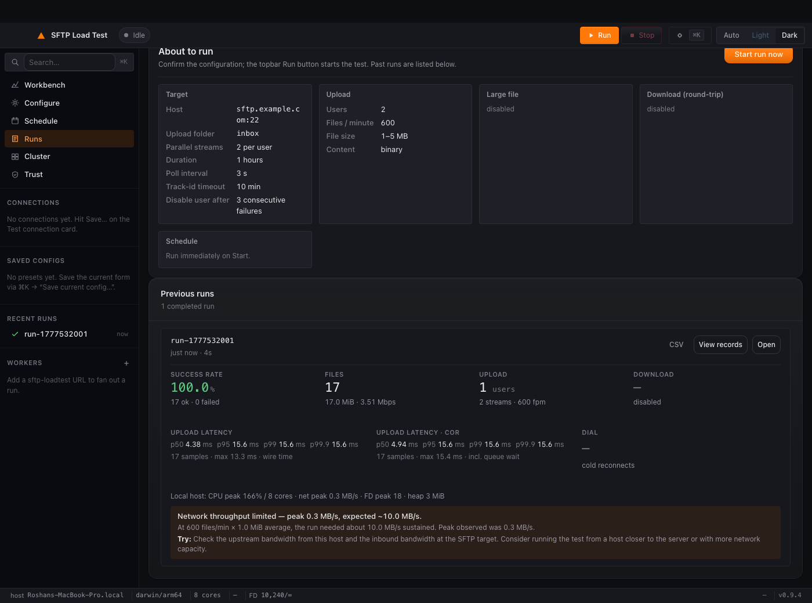
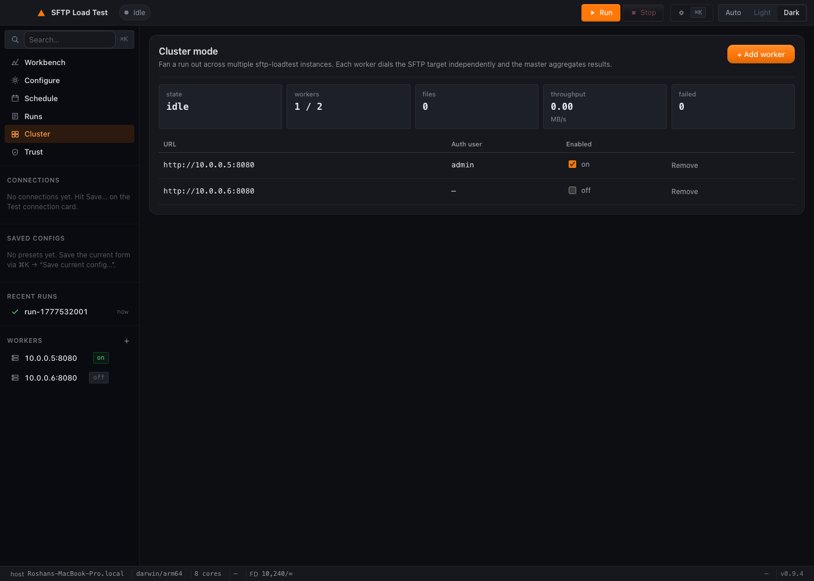
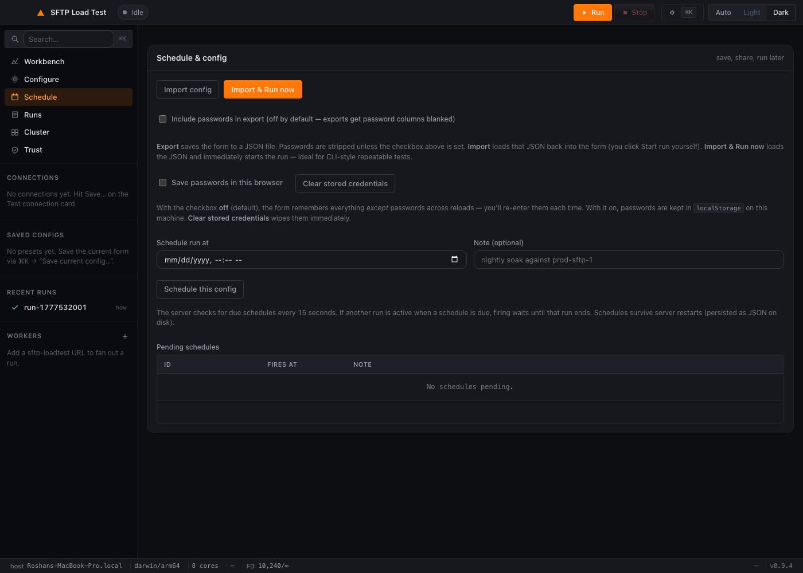
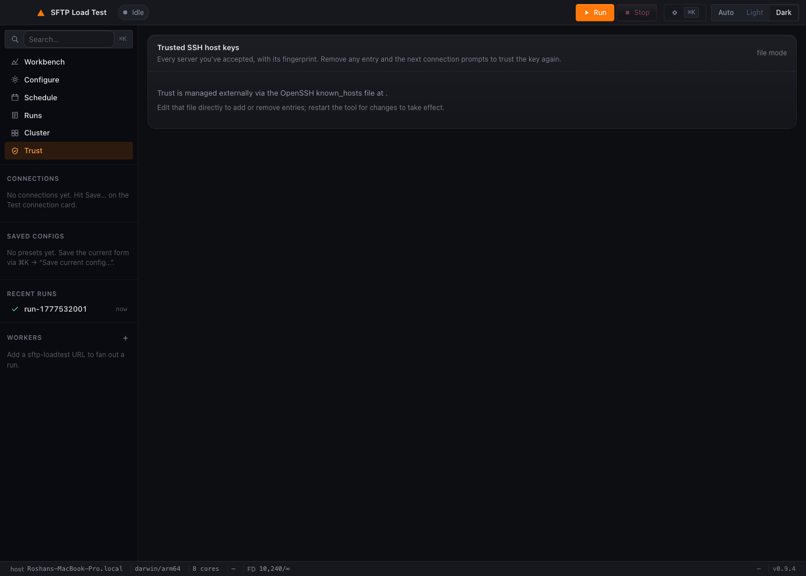
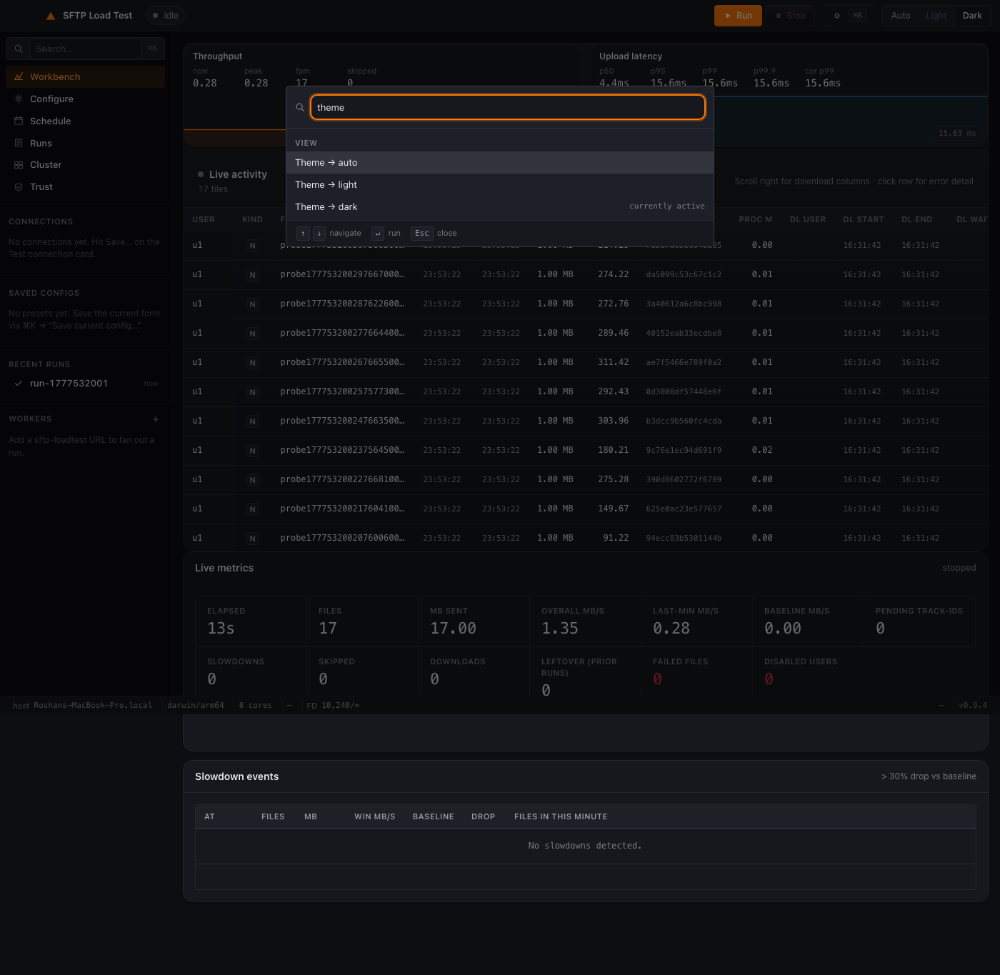

# utilities

> A small collection of self-contained engineering utilities. Each tool
> lives in its own subdirectory, builds to a single static binary, and
> ships pre-built for macOS / Linux / Windows.

[](https://github.com/roshandubey-cloud/utilities/releases/latest)
[](LICENSE)


## Top 5 product features

A real load tester earns trust by *doing exactly what the operator
asked* and producing reports that survive a tester's challenge.
Every claim below is exercised by integration tests against an
in-process mock SFTP server, not a slide deck.

<table>
  <tr>
    <td width="20%" align="center"><sub><b>1</b></sub><br><b>Honest concurrency at every layer</b></td>
    <td>When you ask for <b>N parallel streams per user</b>, <b>M users</b>, and <b>K filename patterns per user</b>, you get exactly that — N×M concurrent transfers with K patterns rotating in proportion. Pattern selection is a strict atomic round-robin (not a clock-skewed approximation); integration tests assert <code>max(per-pattern uploads) − min ≤ 1</code> across the run.</td>
  </tr>
  <tr>
    <td align="center"><sub><b>2</b></sub><br><b>Multi-protocol with one config</b></td>
    <td>SFTP, FTP, and FTPS under a single runner. <b>Bastion / SSH ProxyJump</b> for targets behind a jump host. <b>TOFU pinning</b> for both SSH host keys and FTPS leaf certs — first contact pins the fingerprint, subsequent runs verify strictly, changes refuse. Quirk profiles re-enable legacy ssh-rsa or disable EPSV/MLSD/UTF-8 NOOP for misbehaving servers.</td>
  </tr>
  <tr>
    <td align="center"><sub><b>3</b></sub><br><b>End-to-end byte integrity</b></td>
    <td>Optional <b>SHA-256 round-trip verification</b>: streams a hash over every uploaded byte (<code>io.TeeReader</code>) and every downloaded byte (<code>io.MultiWriter</code>), then matches per-file by track-id or filename marker. Mismatches stamp <code>download_error=HASH_MISMATCH</code>; matches bump <code>RunMeta.HashVerified</code>. Two test cases pin synthetic + on-disk source bytes against the wire-faithful round-trip.</td>
  </tr>
  <tr>
    <td align="center"><sub><b>4</b></sub><br><b>Realistic workload shapes</b></td>
    <td>Fixed FPM, <b>step-load ramp</b> (start_fpm + step_fpm every step_every_sec, capped at ceiling_fpm), mixed normal + large-file + download phases concurrently. Real source files from disk OR synthetic generator. Recurring schedules (<code>Xh</code>, <code>Xd</code>, <code>Xm</code>). Multi-worker fan-out via SSH wizard with cumulative reporting — no preinstalled agent.</td>
  </tr>
  <tr>
    <td align="center"><sub><b>5</b></sub><br><b>Defensible reports + alerts</b></td>
    <td>Per-file CSV with upload + download stages, latency, error code, both SHA-256 columns. Run-meta JSON with p50/p95/p99/p99.9 latency histograms, peak CPU/FD/heap, concurrent-runs-at-peak count, suggestions narrative, labelled <code>stop_reason</code> (<code>duration</code>/<code>user</code>/<code>speed-floor</code>/<code>max-failures</code>). Slack / generic webhook / SMTP alerts on configurable triggers (failure count, p99 ms, error rate %, dispatch skips, hash mismatch, speed-floor stop).</td>
  </tr>
</table>

## Top 5 measurement scenarios

What operators actually use this tool to **calculate**. Each scenario
maps to a concrete configuration; the report tells you the answer.

| # | Question you're asking | How you configure it | What the report tells you |
|---|---|---|---|
| 1 | **Capacity ceiling** — at what FPM does the partner SFTP server stop keeping up? | Step-load ramp (start 60 fpm, +20 every 5 min, ceiling 600 fpm) + speed-floor auto-stop at 50% of peak | Run terminates with `stop_reason=speed-floor` at the FPM where throughput drops; the per-minute window in the CSV shows the exact cliff. |
| 2 | **Round-trip processing time** — how long does the partner take to ingest a file (rename / move / outbox)? | Track-id mode + a generous round-trip timeout; ParallelStreams ≥ 2 to keep the upload pipe full | `track_id_wait_sec` and `processing_time_min` per row; p50/p95/p99 in the analysis trailer. |
| 3 | **Multi-tenant capacity** — how many concurrent users can run before the partner pool exhausts? | One CSV row per user (e.g. 50 users × 5 patterns each), single ParallelStream per user | `dispatch_skips` non-zero = capacity hit; per-user error chips in the UI; `disabled_users` list in RunMeta if the failure policy zeroed any out. |
| 4 | **Long-haul stability** — does the pipeline stay clean over 8 hours? | 8-hour duration, moderate FPM, **Verify SHA-256** on, alerts on hash mismatch + p99 ms + error rate | Hourly latency drift in `per_minute` buckets; any silent corruption surfaces as `HASH_MISMATCH` immediately; alerts fire if any threshold trips. |
| 5 | **Migration validation** — does staging behave the same as prod before cutover? | Run identical config against both, with **real-files source** for a fixed fixture set | Compare run-meta JSONs column-by-column: success rate, p50/p99, peak window MBps, hash counts. Differences = pre-cutover risk you can name. |

## How parallel streams actually work

The single most common load-tester question — *"if I configure 5
parallel streams, am I really getting 5 concurrent transfers?"* — has
a long answer worth showing. Here's the path a single file takes
from dispatcher tick to wire bytes.

```
Configure                           Run (per user, ParallelStreams = 5)
┌───────────────────┐               ┌──────────────────────────────────────────┐
│ Users CSV         │               │ Per-user client pool (one per user)      │
│ u1,p1,inv-*,po-*  │  ─── Start ─▶ │ ┌──────┐ ┌──────┐ ┌──────┐ ┌──────┐ ┌──────┐
│ u2,p2,*           │               │ │slot 0│ │slot 1│ │slot 2│ │slot 3│ │slot 4│
└───────────────────┘               │ └──┬───┘ └──┬───┘ └──┬───┘ └──┬───┘ └──┬───┘
ParallelStreams = 5                 │    │        │        │        │        │
                                    │  live    live     live     live     live
                                    │  SSH/    conn     conn     conn     conn
                                    │  FTP                                  
                                    │   conn                                
                                    │    │        │        │        │        │
                                    └────┼────────┼────────┼────────┼────────┘
                                         ▼        ▼        ▼        ▼        ▼
                                          to partner SFTP/FTP/FTPS server
```

**At config time** — when you set `ParallelStreams = 5` and supply a
2-user CSV, the runner builds **two pools of 5 slots each** at Start.
Each slot dials its own SSH (or FTP control) connection up front, so
**10 live connections exist before the dispatcher fires its first
file**. Failures here abort the run with a clear `connect <user>:
<reason>` — auth bugs surface in seconds, not ten minutes into a
session.

**At dispatch time** — every tick (computed from `FilesPerMinute` or
the active ramp), the dispatcher picks the next user via round-robin,
then the next pattern via the strict atomic round-robin (so all
patterns in the user's CSV row get exercised in proportion), and then
attempts a non-blocking acquire on a 5-slot semaphore. If a slot is
free, the upload runs in a goroutine on that slot's persistent
connection. **If every slot is busy, the file is recorded as a
`dispatch_skip` and the dispatcher moves on** — no queueing, no
silent backlog. `dispatch_skips > 0` in the report means the partner
couldn't keep up at the requested FPM, OR your `ParallelStreams`
setting capped capacity below what the FPM needs.

**During transfer** — uploads stream from the source reader
(synthetic generator or on-disk file) directly to the SFTP write
handle via `io.Copy`. When `Verify SHA-256` is on, the reader is
wrapped in `io.TeeReader` to compute the hash without a second pass
over the bytes. Per-slot connections are persistent and
keepalive'd; if a connection drops mid-run, the slot redials lazily
on the next dispatch and the failure is recorded as
`error_code=DIAL` for that file only — the rest of the pool keeps
running.

**Theoretical maximum concurrent transfers** = `users × ParallelStreams`.
For 10 users × 4 streams = 40 concurrent transfers in flight. Real
ceiling is the lower of:

- Partner-side `MaxStartups` / max-sessions setting
- Your local file-descriptor limit (the runner pre-bumps `RLIMIT_NOFILE`
  to 65k where allowed)
- Network bandwidth (look at `peak_window_mbps` in the run meta)

**Verifying it really happened** — every transfer attempt produces a
row in the CSV with its `start_time` and `end_time`. To confirm 5
streams *really* ran in parallel for user `u1`, count rows where
`u1`'s timestamps overlap. The integration test
`TestRunner_AllUserPatternsUsed` does exactly this for the
4-stream × 3-pattern combination — the assertion fails if any
pattern got starved or any stream slot stayed idle.

For the **download** side the model is identical but with one
pool per *download* user instead of upload user, and a polling
worker per download user that drains files from the partner's
outbox folder. Round-trip pairing matches each downloaded file
back to its originating upload row by track-id (or embedded
filename marker) so per-file latency is computed end-to-end.

<table>
  <tr>
    <td width="33%"><a href="sftp-loadtest/docs/screenshots/configure-dark.png"></a><br><sub><b>Configure</b> — Target, Workload (Upload + Large + Download), Limits</sub></td>
    <td width="33%"><a href="sftp-loadtest/docs/screenshots/runs-dark.png"></a><br><sub><b>Runs</b> — Per-run history with CSV download. Cluster runs expand to per-worker rows.</sub></td>
    <td width="33%"><a href="sftp-loadtest/docs/screenshots/cluster-with-workers-dark.png"></a><br><sub><b>Cluster</b> — Multi-worker fan-out via SSH. No preinstalled agent.</sub></td>
  </tr>
  <tr>
    <td><a href="sftp-loadtest/docs/screenshots/schedule-dark.png"></a><br><sub><b>Schedule</b> — Queue runs for later, fires automatically.</sub></td>
    <td><a href="sftp-loadtest/docs/screenshots/trust-dark.png"></a><br><sub><b>Trust</b> — SSH host keys + FTPS leaf certs (TOFU pinning).</sub></td>
    <td><a href="sftp-loadtest/docs/screenshots/cmdk-palette-open-dark.png"></a><br><sub><b>Cmd+K</b> — Every action reachable by typing.</sub></td>
  </tr>
</table>

<sub>All screenshots in dark theme; <a href="sftp-loadtest/docs/screenshots/">light variants in `sftp-loadtest/docs/screenshots/`</a>.</sub>

---

## Tools

| Tool | What it does | Languages |
|---|---|---|
| [**sftp-loadtest/**](./sftp-loadtest) | Production-grade SFTP / FTP / FTPS load tester. Wails desktop app + CLI/server SKU sharing one engine. Real-file uploads + byte-faithful round-trip downloads. Multi-worker fan-out via SSH with cumulative reporting. ~10 MB binary, sub-15 MB RSS at idle. | Go |
| [**http-cmd-runner/**](./http-cmd-runner) | Tiny HTTP wrapper that executes Linux commands/scripts on the host and returns stdout/stderr/exit-code as JSON. Single static binary, stdlib only, no dependencies. Allowlist or arbitrary-command modes; optional systemd unit and Docker image. | Go |

## 6 video tutorials

[Production-ready scripts](sftp-loadtest/docs/tutorials/) for ~3-minute customer-grade walkthrough videos. Storyboards include exact UI actions, values to type, and word-for-word VO scripts:

| | Tutorial | What it teaches |
|---|---|---|
| 01 | [First run in 90 seconds](sftp-loadtest/docs/tutorials/01-first-run.md) | Synthetic upload + TOFU + CSV export |
| 02 | [Real files end-to-end](sftp-loadtest/docs/tutorials/02-real-files-end-to-end.md) | local-dir source + local-disk sink + SHA-256 verification |
| 03 | [N accounts via conventions](sftp-loadtest/docs/tutorials/03-n-accounts-conventions.md) | Layout picker + per-user probe matrix |
| 04 | [Round-trip + processing time](sftp-loadtest/docs/tutorials/04-roundtrip-processing-time.md) | Track-id / filename modes + p50/p95/p99 |
| 05 | [Worker fan-out](sftp-loadtest/docs/tutorials/05-worker-fanout-cluster.md) | SSH wizard + Distribute toggle + cumulative reporting |
| 06 | [Enterprise: FTPS, trust, scheduling](sftp-loadtest/docs/tutorials/06-enterprise-trust-scheduling.md) | TOFU + Trust panel as audit surface + scheduled runs |

---

## Major release highlights

Every `v0.X.0` is a meaningful feature drop. Patch releases (`v0.X.Y` for Y > 0)
are bug fixes / UX polish — see the [full CHANGELOG](sftp-loadtest/CHANGELOG.md) for those.

| Version | Headline | Release notes |
|---|---|---|
| **v0.14.x** | **Sources & sinks** — real files from disk in / round-trip back to disk out. Layout picker (`flat` / `by-user` / `by-pattern` / `by-user-pattern`) for n-account tests. Smart auto-link source → sink. Server-rendered version pill. Full export/import round-trip parity. | [v0.14.20](https://github.com/roshandubey-cloud/utilities/releases/tag/v0.14.20) |
| **v0.13.x** | **Multi-protocol** — FTP + FTPS join SFTP under one run model. Protocol picker auto-snaps the port; FTPS supports both Explicit (AUTH TLS, port 21) and Implicit (TLS from byte 0, port 990). FTPS leaf-cert TOFU pinning. | [v0.13.30](https://github.com/roshandubey-cloud/utilities/releases/tag/v0.13.30) |
| **v0.12.0** | **Cross-platform visual parity** — bundle Inter + JetBrains Mono, drop Windows-only tone overrides. macOS / Linux / Windows render identically. | [v0.12.0](https://github.com/roshandubey-cloud/utilities/releases/tag/v0.12.0) |
| **v0.11.0** | **SSH-bootstrapped cluster spawn** — the controller installs + starts remote `sftp-loadtest` workers over SSH, fans out a single run across N workers, aggregates metrics back to the controller UI. No preinstalled agent. | [v0.11.0](https://github.com/roshandubey-cloud/utilities/releases/tag/v0.11.0) |
| **v0.10.0** | **SSH public-key auth** — paste a PEM in the connection card; every user authenticates with that key (shared-key model for v1). | [v0.10.0](https://github.com/roshandubey-cloud/utilities/releases/tag/v0.10.0) |
| **v0.9.0** | **Workbench redesign** — sidebar nav + view switcher (Workbench / Configure / Schedule / Runs / Cluster / Trust), Cmd+K palette, slim run-summary bar with live chips, dark/light themes. 8 waves, 75 specs. | [v0.9.0](https://github.com/roshandubey-cloud/utilities/releases/tag/v0.9.0) |
| **v0.8.0** | **Cluster mode MVP** — breaks the single-host ceiling. Add `sftp-loadtest` worker URLs, enable the Distribute toggle, one Start fans out via `/api/cluster/start`. | [v0.8.0](https://github.com/roshandubey-cloud/utilities/releases/tag/v0.8.0) |
| **v0.7.0** | **Tool-managed SSH trust store** — all key state lives in the UI. Trust panel lists pinned SSH host keys with SHA-256 fingerprints; click × to forget. | [v0.7.0](https://github.com/roshandubey-cloud/utilities/releases/tag/v0.7.0) |
| **v0.6.0** | **Post-run analysis** — host-capacity peaks (CPU / FD / network) cross-referenced with the slowdown timeline; config suggestions based on what bottlenecked. | [v0.6.0](https://github.com/roshandubey-cloud/utilities/releases/tag/v0.6.0) |
| **v0.5.0** | **Host-key consent during runs** — Test connection probe surfaces an unknown host's fingerprint in a modal and pins it on approval. Simplified users editor. | [v0.5.0](https://github.com/roshandubey-cloud/utilities/releases/tag/v0.5.0) |
| **v0.4.0** | **Desktop SKU + Grafana-style UI redesign** — Wails-based native app for macOS / Linux / Windows alongside the CLI/server SKU. Per-asset release pipeline; one binary per zip. | [v0.4.0](https://github.com/roshandubey-cloud/utilities/releases/tag/v0.4.0) |
| **v0.3.0** | **TOFU host-key enrollment** via the Test connection button. Pinned in `~/.ssh/known_hosts` automatically; subsequent runs verify strictly. | [v0.3.0](https://github.com/roshandubey-cloud/utilities/releases/tag/v0.3.0) |
| **v0.2.0** | **Self-updating release links** — README and CI use `releases/latest/download/<asset>` pattern so download links don't go stale on every tag. | [v0.2.0](https://github.com/roshandubey-cloud/utilities/releases/tag/v0.2.0) |
| **v0.1.0** | **Initial public release** — first tagged build with the LinkedIn launch artefacts. | [v0.1.0](https://github.com/roshandubey-cloud/utilities/releases/tag/v0.1.0) |

[**All releases →**](https://github.com/roshandubey-cloud/utilities/releases)

---

## Conventions across all tools

- **One static binary per platform.** No Python, no Node, no JVM, no
  installer. `chmod +x` (or unblock on Windows) and run.
- **Cross-platform.** Each tool ships pre-built for darwin/arm64,
  darwin/amd64, linux/amd64, linux/arm64, windows/amd64.
- **Web UI on `127.0.0.1` by default.** No bundled authentication —
  expose via SSH tunnel or put nginx in front for remote access.
- **Two SKUs per tool where relevant.** A CLI / server binary plus a
  Wails-native desktop app. Same code, same UI, two transport shells.
- **MIT license.** See [LICENSE](./LICENSE).

## Building from source

Each tool has its own `go.mod`. From a clean clone:

```sh
git clone https://github.com/roshandubey-cloud/utilities.git
cd utilities/sftp-loadtest
go build -o sftp-loadtest .
./sftp-loadtest
```

Cross-compile:

```sh
GOOS=linux  GOARCH=amd64 go build -o sftp-loadtest-linux-amd64  .
GOOS=darwin GOARCH=arm64 go build -o sftp-loadtest-mac-arm64    .
GOOS=windows GOARCH=amd64 go build -o sftp-loadtest-win.exe     .
```

Desktop SKU (Wails) build:

```sh
cd cmd/desktop
wails build
# Output: cmd/desktop/build/bin/sftp-loadtest-desktop.app  (macOS)
#         cmd/desktop/build/bin/sftp-loadtest-desktop      (Linux)
#         cmd/desktop/build/bin/sftp-loadtest-desktop.exe  (Windows)
```

## Contributing

Issues, PRs, and feature ideas welcome. Each tool's behaviour is small
enough to fit in your head; please read the tool's `README.md` before
proposing changes.
