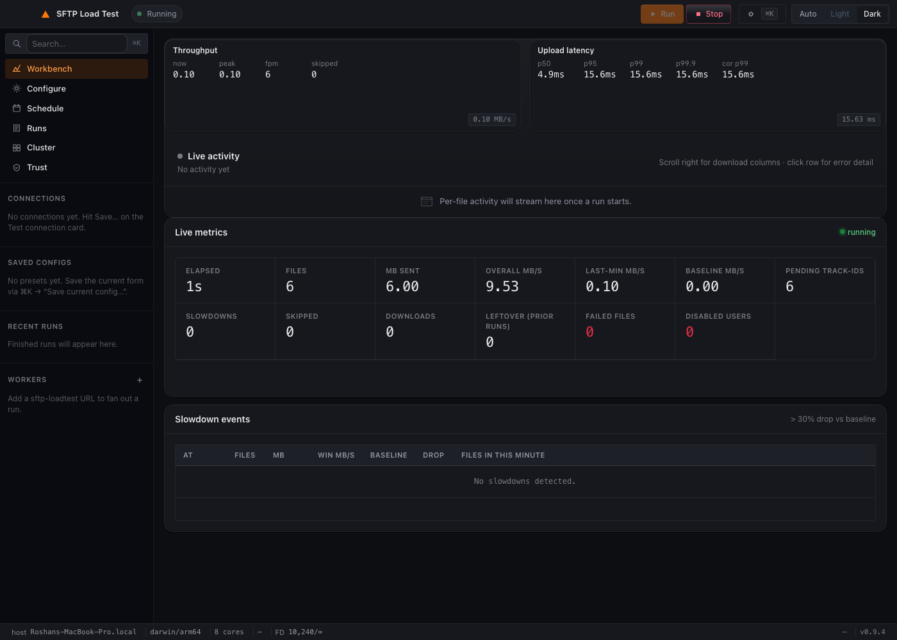
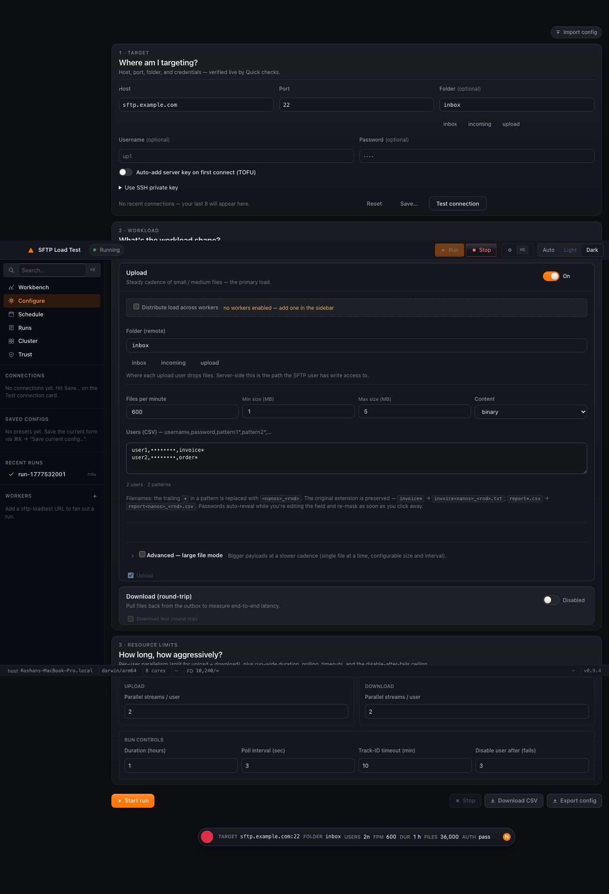

# sftp-loadtest

A lightweight, production-grade SFTP load-testing tool with a built-in web
UI. Designed to be the kind of tool you can hand to a client and trust on
a 24-hour run against their production SFTP server without it lying to you,
running away with memory, or going silently into the weeds when the network
hiccups.

- **~10 MB single static binary**, zero dependencies, runs on macOS / Linux / Windows.
- **Sub-15 MB RSS at idle**, RAM stays flat over multi-hour high-FPM runs (streaming CSV writer).
- **Honest measurements**: per-file timings substituted with minute-window rates when the per-file number isn't reliable; never blank, never fake.
- **Self-healing**: SSH keepalives, automatic redial on dropped pool slots, watcher reconnect on idle-timeout.
- **Per-user auto-disable** after N consecutive failures so one bad credential doesn't poison the run.
- **Streaming CSV report** to disk during the run + atomic metadata JSON on teardown.
- **Built-in scheduler**: queue runs for later, fires automatically, persists across restarts.
- **Test connection** button validates TCP / SSH / SFTP / folder list before you commit to a real run.
- **Apple-TV-class workbench UI** with sidebar nav, slim run-summary bar, Cmd+K palette, live charts, and dark / light themes.
- **SSH host-key verification** on by default (TOFU enrollment from the UI; per-user `known_hosts` auto-managed in the desktop SKU).
- **SSH public-key auth** in addition to passwords — paste a PEM in the connection card and every user authenticates with that key.
- **Saved connections + saved configs** — name a host:port:user combo, recall it from the sidebar with one click; save the whole form as a preset and load it via Cmd+K.

## Screenshots

### Workbench (live run, dark theme)


### Configure (dark theme)


### More screenshots

| View | Dark | Light |
|---|---|---|
| Workbench (idle) | [workbench-idle-dark](docs/screenshots/workbench-idle-dark.png) | [workbench-idle-light](docs/screenshots/workbench-idle-light.png) |
| Workbench (active) | [workbench-active-dark](docs/screenshots/workbench-active-dark.png) | [workbench-active-light](docs/screenshots/workbench-active-light.png) |
| Configure | [configure-dark](docs/screenshots/configure-dark.png) | [configure-light](docs/screenshots/configure-light.png) |
| Schedule | [schedule-dark](docs/screenshots/schedule-dark.png) | [schedule-light](docs/screenshots/schedule-light.png) |
| Runs | [runs-dark](docs/screenshots/runs-dark.png) | [runs-light](docs/screenshots/runs-light.png) |
| Cluster (with workers) | [cluster-with-workers-dark](docs/screenshots/cluster-with-workers-dark.png) | [cluster-with-workers-light](docs/screenshots/cluster-with-workers-light.png) |
| Trust | [trust-dark](docs/screenshots/trust-dark.png) | [trust-light](docs/screenshots/trust-light.png) |
| Cmd+K palette | [cmdk-palette-open-dark](docs/screenshots/cmdk-palette-open-dark.png) | [cmdk-palette-open-light](docs/screenshots/cmdk-palette-open-light.png) |
| Host-key consent | [host-key-consent-modal-dark](docs/screenshots/host-key-consent-modal-dark.png) | [host-key-consent-modal-light](docs/screenshots/host-key-consent-modal-light.png) |

## Feature tour

| Area | What you'll find |
|---|---|
| **Workbench** | Live throughput + upload-latency charts, the live-metrics tile grid (elapsed / files / overall MB/s / last-min / baseline / slowdowns / failures), the streaming Live activity table, and the slowdown events panel. |
| **Configure** | The Quick checks card (host / port / folder / user / password / TOFU / SSH key disclosure / Save… / Test connection), the Upload + Download workload cards, the resource-limits sub-groups (Upload / Download / Run), and the slim sticky run-summary bar with a play/stop button. |
| **Schedule** | Pick a fire-at time, queue a run, see pending schedules in a table, cancel any of them. Import config / Import & Run-now also live here. |
| **Runs** | An "About to run" plan section that mirrors the current form, plus the past-runs history list — each card has KPIs, latency percentiles, an analyser panel, the CSV download link, and an Open button to drill into the detail pane. |
| **Cluster** | Add `sftp-loadtest` worker URLs (with optional basic-auth creds), enable / disable each, and flip the **Distribute load across workers** toggle so a single Start fans out via `/api/cluster/start`. **Cluster fan-out — bootstrap workers over SSH from the UI** (v0.11.0): the Add worker modal's SSH tab installs + spawns the binary on a remote and tunnels HTTP back through the SSH session — no extra port to open. See [docs/howto.md §7a](docs/howto.md). |
| **Trust** | The trusted SSH host-key list. Each row shows the SHA-256 fingerprint; click × to forget a key (next connection prompts again). |
| **Cmd+K palette** | Run / Stop / Test connection / Toggle theme / Toggle sidebar / Save config / Load preset / View past run — every primary action is reachable by typing. |
| **Saved connections** | Curated host:port:user (and optionally password) entries. The sidebar Connections section keeps these above the auto-tracked recents; click any row to refill all four credential fields in one shot. |
| **Theme switcher** | Three-state segmented control on the topbar: Auto follows the OS, Light and Dark force the theme via `<html data-theme>`. The choice persists across reloads. |

## Quick start

> **Need a step-by-step?** See [docs/howto.md](docs/howto.md) for ten flow walkthroughs (first-time setup, SSH key auth, scheduling, cluster fan-out, …).

The tool ships in **two flavors**. Pick whichever fits how you want to run it.

| | **Server** | **Desktop** |
|---|---|---|
| **What** | CLI binary that hosts the web UI on a TCP port | Native macOS / Linux / Windows app |
| **Run model** | `./sftp-loadtest`, then open `localhost:8080` in a browser | Double-click the `.app` / `.exe` / `AppImage`, native window opens |
| **Headless / systemd** | ✅ yes — purpose-built for it | ❌ no — needs a desktop session |
| **Allocates a TCP port** | yes (default `127.0.0.1:8080`) | no |
| **Multi-user / shared** | ✅ runs as a service, multiple ops can connect | one user per machine |
| **Best for** | lab racks, CI, long-running scheduled tests, server installs | client laptops, ad-hoc tests, shipping to non-technical users |

Both SKUs share the **same** load engine, UI, security model, and CSV report format. They are released in lockstep — every tagged release contains both.

### Pre-built binaries

Each download is a **single binary or a single `.app` bundle** — pick the row that matches your machine. The links below always resolve to the **latest** release (bookmark-stable). On the release page itself you'll also see versioned filenames like `sftp-loadtest-webui-v0.4.0-mac-apple-silicon.zip` for explicit version pinning.

#### web-ui flavor (CLI binary, hosts the UI on a TCP port)

| Platform / arch | Download (latest) |
|---|---|
| macOS · Apple Silicon (arm64) | [sftp-loadtest-webui-mac-apple-silicon.zip](https://github.com/roshandubey-cloud/utilities/releases/latest/download/sftp-loadtest-webui-mac-apple-silicon.zip) |
| macOS · Intel (amd64) | [sftp-loadtest-webui-mac-intel.zip](https://github.com/roshandubey-cloud/utilities/releases/latest/download/sftp-loadtest-webui-mac-intel.zip) |
| Linux · amd64 | [sftp-loadtest-webui-linux-amd64.zip](https://github.com/roshandubey-cloud/utilities/releases/latest/download/sftp-loadtest-webui-linux-amd64.zip) |
| Linux · arm64 | [sftp-loadtest-webui-linux-arm64.zip](https://github.com/roshandubey-cloud/utilities/releases/latest/download/sftp-loadtest-webui-linux-arm64.zip) |
| Windows · amd64 | [sftp-loadtest-webui-windows-amd64.zip](https://github.com/roshandubey-cloud/utilities/releases/latest/download/sftp-loadtest-webui-windows-amd64.zip) |

#### desktop-app flavor (native app, no allocated port)

| Platform / arch | Download (latest) |
|---|---|
| macOS · Apple Silicon (arm64) | [sftp-loadtest-desktop-app-mac-apple-silicon.zip](https://github.com/roshandubey-cloud/utilities/releases/latest/download/sftp-loadtest-desktop-app-mac-apple-silicon.zip) |
| macOS · Intel (amd64) | [sftp-loadtest-desktop-app-mac-intel.zip](https://github.com/roshandubey-cloud/utilities/releases/latest/download/sftp-loadtest-desktop-app-mac-intel.zip) |
| Linux · amd64 | [sftp-loadtest-desktop-app-linux-amd64.zip](https://github.com/roshandubey-cloud/utilities/releases/latest/download/sftp-loadtest-desktop-app-linux-amd64.zip) |
| Windows · amd64 | [sftp-loadtest-desktop-app-windows-amd64.zip](https://github.com/roshandubey-cloud/utilities/releases/latest/download/sftp-loadtest-desktop-app-windows-amd64.zip) |

The desktop SKU stores reports and schedules under your platform's standard
user-config directory (`~/Library/Application Support/sftp-loadtest/` on
macOS, `~/.config/sftp-loadtest/` on Linux, `%APPDATA%\sftp-loadtest\` on
Windows). It auto-creates `~/.ssh/known_hosts` and uses TOFU enrollment
through the same Test Connection checkbox the server SKU has.

All releases: [github.com/roshandubey-cloud/utilities/releases](https://github.com/roshandubey-cloud/utilities/releases/latest)

```sh
# macOS (Apple Silicon) — web-ui flavor
curl -LO https://github.com/roshandubey-cloud/utilities/releases/latest/download/sftp-loadtest-webui-mac-apple-silicon.zip
unzip sftp-loadtest-webui-mac-apple-silicon.zip
xattr -cr ./sftp-loadtest-mac-apple-silicon && chmod +x ./sftp-loadtest-mac-apple-silicon
./sftp-loadtest-mac-apple-silicon

# macOS (Intel) — web-ui flavor
curl -LO https://github.com/roshandubey-cloud/utilities/releases/latest/download/sftp-loadtest-webui-mac-intel.zip
unzip sftp-loadtest-webui-mac-intel.zip
xattr -cr ./sftp-loadtest-mac-intel && chmod +x ./sftp-loadtest-mac-intel
./sftp-loadtest-mac-intel

# Linux (amd64) — web-ui flavor
curl -LO https://github.com/roshandubey-cloud/utilities/releases/latest/download/sftp-loadtest-webui-linux-amd64.zip
unzip sftp-loadtest-webui-linux-amd64.zip
chmod +x ./sftp-loadtest-linux-amd64
./sftp-loadtest-linux-amd64

# Windows (amd64) — web-ui flavor (PowerShell)
Invoke-WebRequest https://github.com/roshandubey-cloud/utilities/releases/latest/download/sftp-loadtest-webui-windows-amd64.zip -OutFile sftp-loadtest-webui-windows-amd64.zip
Expand-Archive sftp-loadtest-webui-windows-amd64.zip
.\sftp-loadtest-webui-windows-amd64\sftp-loadtest-windows-amd64.exe
```

**desktop-app flavor:** download the zip for your platform from the second
table above, unzip, and double-click. No flags needed — all options are
configurable from the native window. macOS users get a Gatekeeper warning
the first time (self-signed); right-click → Open, then "Open Anyway".

> **SSH host-key verification is on by default.** No flags required — the
> tool auto-creates a per-user `known_hosts` file under your OS config
> directory, and the UI prompts you to trust each new server's key the
> first time you connect (and prompts again if a server's key changes).
> Override the path with `-known-hosts <file>`, or pass `-insecure-host-key`
> for ephemeral lab tests. See [docs/security.md](docs/security.md) for
> the full security model.

You'll see:
```
sftp-loadtest listening on http://127.0.0.1:8080  reports=…  schedules=…
```

Open `http://127.0.0.1:8080` in a browser.

### From source

```sh
git clone https://github.com/roshandubey-cloud/utilities.git
cd utilities/sftp-loadtest
go build -o sftp-loadtest .
./sftp-loadtest
```

Requires **Go 1.21+**.

### Run as a service (Linux, boots with the OS)

For long-lived deployments — auto-start at boot, restart on crash, log to
journald — see [docs/systemd.md](docs/systemd.md).

## Command-line flags

| Flag | Default | Purpose |
|---|---|---|
| `-addr ip:port` | `127.0.0.1:8080` | Web-UI listen address. Bind to `127.0.0.1` and SSH-tunnel for remote access. |
| `-reports-dir path` | `./reports` | Where finished-run CSV + metadata JSON are persisted. |
| `-schedules-dir path` | `./schedules` | Where pending scheduled runs live. Empty string disables the scheduler. |
| `-debug` | off | Mounts `/debug/pprof/` for live profiling. |

## What it actually does

1. **Upload phase** — each upload user logs into your SFTP server (password
   or SSH-key auth, your pick) and streams generated random-byte files
   into the upload folder (e.g. `inbox`) at the configured files-per-minute
   rate.
2. **Track-ID watcher** — polls each user's upload folder looking for the
   server to rename `foo.txt` → `foo.txt#<trackid>`. Captures the trackid
   and the *processing time* (minutes from upload-end to track-id-detected).
3. **Optional download phase** — each download user independently polls
   its own remote folder (e.g. `outbox`) and pulls every file it sees with
   a `#<trackid>` suffix. Downloads are attributed back to the originating
   upload row by basename — no pre-configured upload→download mapping is
   required on the tool side.
4. **Streaming CSV** — finalized rows are appended to disk every 5s so the
   in-memory record store stays bounded. A live `Download CSV` link
   concatenates the on-disk file with the in-memory tail.
5. **Auto-disable** — any user account that hits N consecutive failed ops
   (default 3) is taken out of rotation and recorded in the report.

## Server requirements

For the round-trip story to work, your SFTP server must:

1. **Append a `#<trackid>` suffix** to each processed file (anywhere in
   the upload folder).
2. **Place the processed file** in the download user's folder
   (e.g. `outbox`) — however you choose to wire that up.

Without this, uploads will succeed but downloads will see nothing.

## Authentication / security

The tool ships **without authentication on the web UI**. Anyone who can
reach `:8080` can start a load test. Recommended deployments:

- **Local laptop**: bind to `127.0.0.1` (default), open `localhost:8080`.
- **Remote server**: bind to `127.0.0.1`, then `ssh -L 8080:localhost:8080 user@server` and open `localhost:8080` in your local browser.
- **Multi-tenant**: put nginx / Caddy with basic-auth in front.

The tool authenticates to the **target SFTP** server in one of two ways,
selected per run:

- **Password auth** (default) — every user CSV row carries a username + password.
- **SSH public-key auth** (v0.10.0) — open the **Use SSH private key** disclosure on the Quick checks card, paste a PEM, and every user authenticates with that single key. The CSV password column is ignored. The PEM lives in memory only — it never reaches `localStorage` unless you opt-in to "Include passwords" during Export config.

**SSH host-key verification is on by default** (v0.9.3). The Test
connection button drives a Trust-On-First-Use enrollment: the first time
you hit a server, the UI shows the SHA-256 fingerprint and asks you to
accept it before continuing. Already-trusted keys connect silently;
**changed** keys are refused loudly with both fingerprints surfaced in
the UI — no `known_hosts` editing required. The desktop SKU auto-creates
a per-user `known_hosts` under your platform's standard config directory.
See [docs/security.md](docs/security.md) for the full security model.

**Saved connections** (v0.10.1) — the Save… button on the Quick checks
card persists host / port / username (and optionally password) as a
named entry in the sidebar. Click any row in the Connections section to
refill all four credential fields. Saved connections live in
`localStorage`, scoped to the browser/origin where you saved them; the
"Save passwords in this browser" master toggle still controls whether
the password column gets persisted at all.

## Endpoints (for CLI / scripted use)

| Endpoint | What |
|---|---|
| `GET  /healthz` | liveness — `{status, uptime_sec, active_run, active_run_id}` |
| `GET  /api/host` | one-shot host capacity (CPU, RAM, FD limit, NICs) |
| `GET  /api/status` | live run state, metrics, error counts, disabled users, FD-in-use |
| `GET  /api/runs` | history — both live (in-memory) and historical (on-disk) runs |
| `POST /api/start` | start a run with a JSON config |
| `POST /api/stop` | stop the active run |
| `GET  /api/report.csv?run=<id>` | streaming CSV download (live or historical) |
| `POST /api/probe` | TCP / SSH / SFTP / folder-list pre-flight check |
| `POST /api/schedule` | queue a future run |
| `GET  /api/schedules` | list pending schedules |
| `POST /api/schedule/cancel?id=<id>` | cancel a pending schedule |

See [`examples/sample-50users.json`](examples/sample-50users.json) for a
full config you can `POST` to `/api/start` (or import via the UI).

## Resource footprint

| State | RSS | CPU | Goroutines |
|---|---|---|---|
| Idle (no run active) | ~8 MB | ~0% | 6 |
| 50-user × 30-stream run @ 1k fpm | ~200–350 MB | < 5% | ~120 |

Memory stays **flat over the entire run** thanks to the streaming flusher
(records are sealed to disk and freed as soon as their trackid + download
are resolved). A 24h test against one SFTP server typically holds
< 350 MB RSS the whole time.

Each parallel SSH stream consumes one file descriptor; the tool will
auto-raise `RLIMIT_NOFILE` to 4,096 at startup where the kernel allows.
For very high concurrency (~100 users × 30 streams) raise the hard cap
yourself: `ulimit -n 16384` or `LimitNOFILE=16384` in a systemd unit.

## Design notes

- **No external dependencies at runtime**. The UI is one self-contained
  HTML file with inline CSS + JS, embedded into the binary via `//go:embed`.
- **Cross-platform stdlib only**. `runtime`, `syscall`, `net`, `os`,
  `golang.org/x/crypto/ssh`, `github.com/pkg/sftp`. That's it.
- **Build-tagged platform code** keeps Windows compiling cleanly even
  for the unix-only bits (`/dev/fd` reads, `RLIMIT_NOFILE`, `sysctl
  hw.memsize`).
- **Streaming first**: every observable that can grow without bound
  (records, slowdowns, per-minute buckets) is either bounded in memory
  or streamed to disk.
- **Honest measurements**: when per-file timing is unreliable
  (< 1 MiB or < 100 ms transfer), the speed column is filled from the
  matching minute-window rate with a small `·w` marker so the value is
  never blank or misleading.

## Limitations

- No HTTPS on the web UI itself (use `-tls-cert` / `-tls-key` to enable, or front it with nginx / Caddy).
- Single concurrent run per process (run multiple processes on different ports for true parallelism, or use the Cluster view to fan-out across worker URLs).
- Per-user SSH keys are a v2 follow-up — current shared-key support uses one PEM for all users in the run, which covers the single-test-identity case but not "each user has their own key" scenarios. Mix-and-match (some users password, some users key) is also v2.
- No SSH-agent integration — paste a PEM, don't expect socket-based agent forwarding.

## License

MIT — see [LICENSE](../LICENSE).
