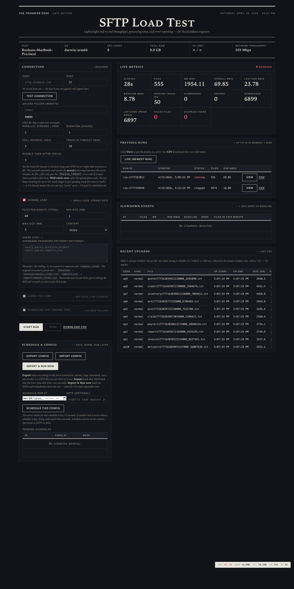
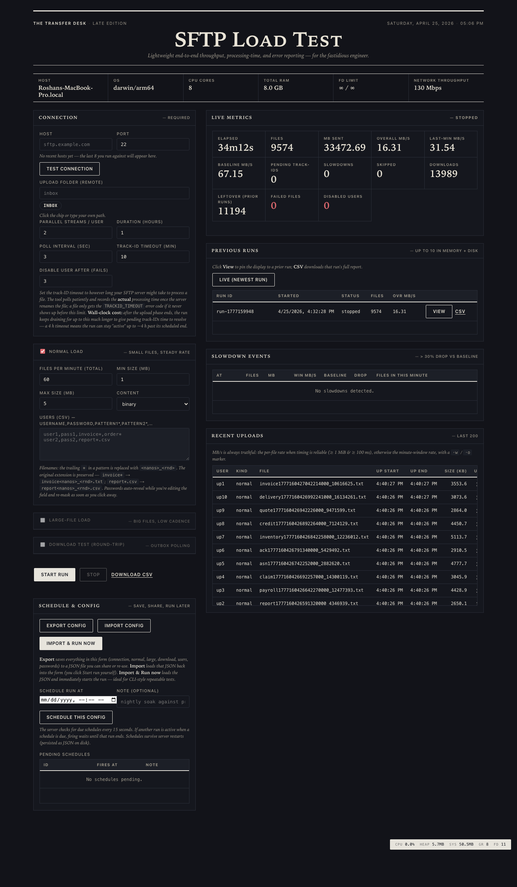

# sftp-loadtest

A lightweight, production-grade SFTP load-testing tool with a built-in web
UI. Designed to be the kind of tool you can hand to a client and trust on
a 24-hour run against their production SFTP server without it lying to you,
running away with memory, or going silently into the weeds when the network
hiccups.

- **~10 MB single static binary**, zero dependencies, runs on macOS / Linux / Windows.
- **Sub-15 MB RSS at idle**, RAM stays flat over multi-hour high-FPM runs (streaming CSV writer).
- **Honest measurements**: per-file timings substituted with minute-window rates when the per-file number isn't reliable; never blank, never fake.
- **Self-healing**: SSH keepalives, automatic redial on dropped pool slots, watcher reconnect on idle-timeout.
- **Per-user auto-disable** after N consecutive failures so one bad credential doesn't poison the run.
- **Streaming CSV report** to disk during the run + atomic metadata JSON on teardown.
- **Built-in scheduler**: queue runs for later, fires automatically, persists across restarts.
- **Test connection** button validates TCP / SSH / SFTP / folder list before you commit to a real run.
- **Newspaper-themed UI** that auto-respects dark mode.

## Screenshots

### Live test in progress


### Idle / between runs


## Quick start

### Pre-built binaries

Download the right zip from the [latest release](https://github.com/roshandubey-cloud/utilities/releases) (or build from source — see below).

```sh
# macOS (Apple Silicon)
xattr -cr ./sftp-loadtest-mac-apple-silicon
chmod +x  ./sftp-loadtest-mac-apple-silicon
./sftp-loadtest-mac-apple-silicon

# Linux
chmod +x ./sftp-loadtest-linux-amd64
./sftp-loadtest-linux-amd64

# Windows
.\sftp-loadtest-windows-amd64.exe
```

You'll see:
```
sftp-loadtest listening on http://127.0.0.1:8080  reports=…  schedules=…
```

Open `http://127.0.0.1:8080` in a browser.

### From source

```sh
git clone https://github.com/roshandubey-cloud/utilities.git
cd utilities/sftp-loadtest
go build -o sftp-loadtest .
./sftp-loadtest
```

Requires **Go 1.21+**.

### Run as a service (Linux, boots with the OS)

For long-lived deployments — auto-start at boot, restart on crash, log to
journald — see [docs/systemd.md](docs/systemd.md).

## Command-line flags

| Flag | Default | Purpose |
|---|---|---|
| `-addr ip:port` | `127.0.0.1:8080` | Web-UI listen address. Bind to `127.0.0.1` and SSH-tunnel for remote access. |
| `-reports-dir path` | `./reports` | Where finished-run CSV + metadata JSON are persisted. |
| `-schedules-dir path` | `./schedules` | Where pending scheduled runs live. Empty string disables the scheduler. |
| `-debug` | off | Mounts `/debug/pprof/` for live profiling. |

## What it actually does

1. **Upload phase** — each upload user logs into your SFTP server (password
   auth) and streams generated random-byte files into the upload folder
   (e.g. `inbox`) at the configured files-per-minute rate.
2. **Track-ID watcher** — polls each user's upload folder looking for the
   server to rename `foo.txt` → `foo.txt#<trackid>`. Captures the trackid
   and the *processing time* (minutes from upload-end to track-id-detected).
3. **Optional download phase** — each download user independently polls
   its own remote folder (e.g. `outbox`) and pulls every file it sees with
   a `#<trackid>` suffix. Downloads are attributed back to the originating
   upload row by basename — no pre-configured upload→download mapping is
   required on the tool side.
4. **Streaming CSV** — finalized rows are appended to disk every 5s so the
   in-memory record store stays bounded. A live `Download CSV` link
   concatenates the on-disk file with the in-memory tail.
5. **Auto-disable** — any user account that hits N consecutive failed ops
   (default 3) is taken out of rotation and recorded in the report.

## Server requirements

For the round-trip story to work, your SFTP server must:

1. **Append a `#<trackid>` suffix** to each processed file (anywhere in
   the upload folder).
2. **Place the processed file** in the download user's folder
   (e.g. `outbox`) — however you choose to wire that up.

Without this, uploads will succeed but downloads will see nothing.

## Authentication / security

The tool ships **without authentication on the web UI**. Anyone who can
reach `:8080` can start a load test. Recommended deployments:

- **Local laptop**: bind to `127.0.0.1` (default), open `localhost:8080`.
- **Remote server**: bind to `127.0.0.1`, then `ssh -L 8080:localhost:8080 user@server` and open `localhost:8080` in your local browser.
- **Multi-tenant**: put nginx / Caddy with basic-auth in front.

The tool itself only does **password SFTP auth** — no SSH keys, no host-key
verification (any server is trusted). That's appropriate for load testing
disposable test accounts; **don't** use it against a server holding
production data without first auditing the network path.

## Endpoints (for CLI / scripted use)

| Endpoint | What |
|---|---|
| `GET  /healthz` | liveness — `{status, uptime_sec, active_run, active_run_id}` |
| `GET  /api/host` | one-shot host capacity (CPU, RAM, FD limit, NICs) |
| `GET  /api/status` | live run state, metrics, error counts, disabled users, FD-in-use |
| `GET  /api/runs` | history — both live (in-memory) and historical (on-disk) runs |
| `POST /api/start` | start a run with a JSON config |
| `POST /api/stop` | stop the active run |
| `GET  /api/report.csv?run=<id>` | streaming CSV download (live or historical) |
| `POST /api/probe` | TCP / SSH / SFTP / folder-list pre-flight check |
| `POST /api/schedule` | queue a future run |
| `GET  /api/schedules` | list pending schedules |
| `POST /api/schedule/cancel?id=<id>` | cancel a pending schedule |

See [`examples/sample-50users.json`](examples/sample-50users.json) for a
full config you can `POST` to `/api/start` (or import via the UI).

## Resource footprint

| State | RSS | CPU | Goroutines |
|---|---|---|---|
| Idle (no run active) | ~8 MB | ~0% | 6 |
| 50-user × 30-stream run @ 1k fpm | ~200–350 MB | < 5% | ~120 |

Memory stays **flat over the entire run** thanks to the streaming flusher
(records are sealed to disk and freed as soon as their trackid + download
are resolved). A 24h test against one SFTP server typically holds
< 350 MB RSS the whole time.

Each parallel SSH stream consumes one file descriptor; the tool will
auto-raise `RLIMIT_NOFILE` to 4,096 at startup where the kernel allows.
For very high concurrency (~100 users × 30 streams) raise the hard cap
yourself: `ulimit -n 16384` or `LimitNOFILE=16384` in a systemd unit.

## Design notes

- **No external dependencies at runtime**. The UI is one self-contained
  HTML file with inline CSS + JS, embedded into the binary via `//go:embed`.
- **Cross-platform stdlib only**. `runtime`, `syscall`, `net`, `os`,
  `golang.org/x/crypto/ssh`, `github.com/pkg/sftp`. That's it.
- **Build-tagged platform code** keeps Windows compiling cleanly even
  for the unix-only bits (`/dev/fd` reads, `RLIMIT_NOFILE`, `sysctl
  hw.memsize`).
- **Streaming first**: every observable that can grow without bound
  (records, slowdowns, per-minute buckets) is either bounded in memory
  or streamed to disk.
- **Honest measurements**: when per-file timing is unreliable
  (< 1 MiB or < 100 ms transfer), the speed column is filled from the
  matching minute-window rate with a small `·w` marker so the value is
  never blank or misleading.

## Limitations

- Password SFTP auth only — no public-key, no SSH agent.
- No host-key verification — appropriate for load testing, not for
  handling production data.
- No HTTPS on the web UI itself.
- Single concurrent run per process (run multiple processes on different
  ports for true parallelism).

## License

MIT — see [LICENSE](../LICENSE).
